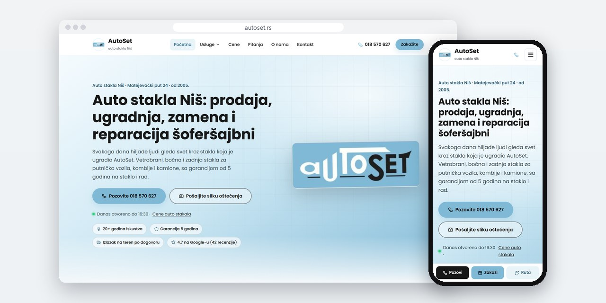
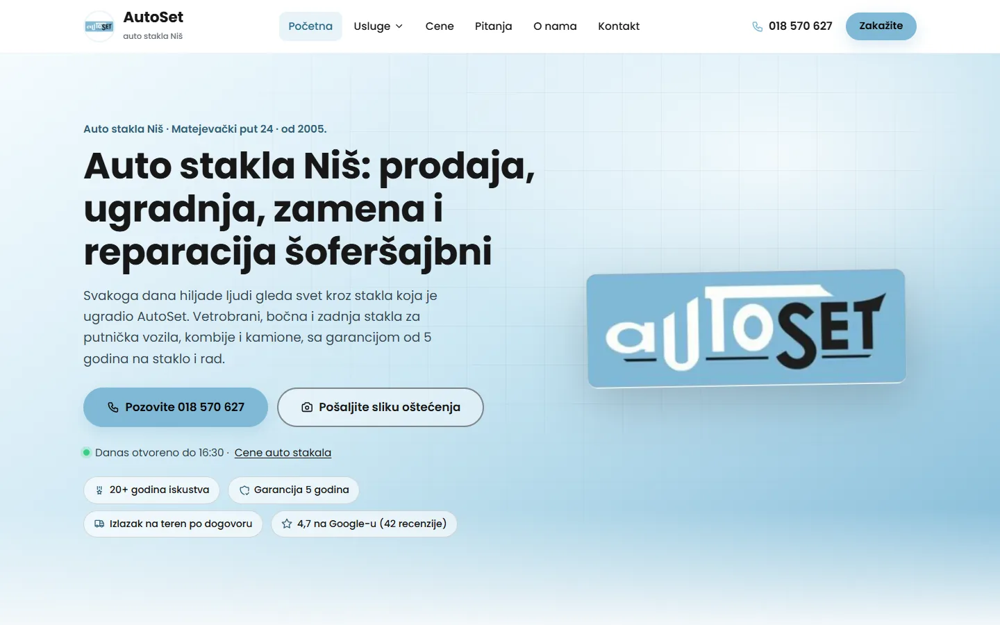
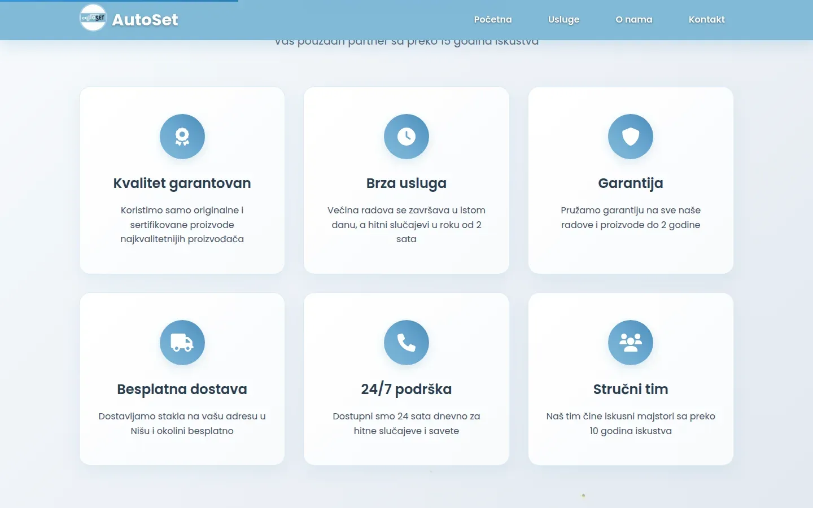
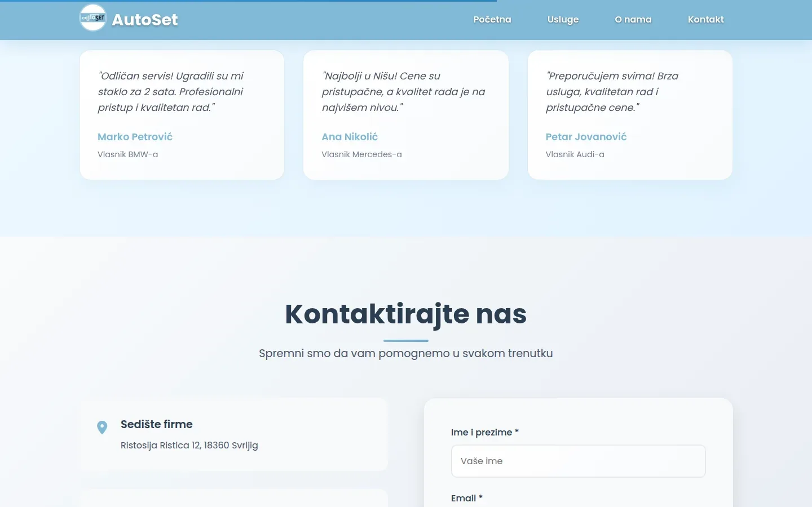

# AutoSet Niš

Site for an auto glass shop in Niš with a page for each service, plus a private stock panel with 700+ items imported from the accounting software.

**[autoset.rs](https://autoset.rs/)** · [Case study (in Serbian)](https://svilenkovic.com/radovi/autoset-nis) · [Srpski](README.sr.md)

> [!NOTE]
> Client project. The source code belongs to the client and stays in a private repository. This page describes what I built and how.

<table>
  <tr><td><b>Client</b></td><td>AutoSet</td></tr>
  <tr><td><b>Industry</b></td><td>Auto glass sales, fitting and repair</td></tr>
  <tr><td><b>Location</b></td><td>Niš, Serbia</td></tr>
  <tr><td><b>Type</b></td><td>Multi-page website with a stock panel</td></tr>
  <tr><td><b>My role</b></td><td>Design, development, SEO, hosting and maintenance</td></tr>
  <tr><td><b>Stack</b></td><td>HTML, PHP 8.3, nginx, PHPMailer, MariaDB (panel)</td></tr>
</table>

## About the project

AutoSet has sold and fitted auto glass in Niš since 2005, from windscreens and side glass to glass for vans, trucks and buses. Nobody plans a trip to a glass shop: a stone hits the windscreen, the driver searches for the service and the city and calls the first site that loads. So every main service has its own page for that search, with the phone number one tap away.

The bigger job came later: a private panel for the counter, with more than 700 stock items and an appointment calendar. The accounting software has no documented API, only a spreadsheet export. The panel imports XLSX in three steps (upload, column mapping with auto-detection, and a preview of new and changed rows) and backs up the whole stock before every write. Most of the trouble was in the data: the same code exists under two manufacturers, so rows are matched on code plus manufacturer, and 94 rows had a code but no name.

## What I built

- A page for each main service, written for searches like windscreen replacement Niš, with its own steps and common questions
- Extensionless URLs through try_files, so a page can move from HTML to PHP without its address changing
- XLSX files checked before parsing, by declared size and compression ratio, after a 1.84 MB file turned out to expand to 529 MB in memory
- A fix for an edit dialog that read rounded prices back from the table and saved them, silently dropping the decimals
- Testing with real mouse clicks, which found a Next button 189 px below the screen edge on a 1366 px laptop and a floating badge that swallowed clicks
- Tests that ship with the panel: 129 checks on data and 43 over the network, including a deliberately built zip bomb

## Results

| | Performance | Accessibility | Best practices | SEO |
| :-- | :-: | :-: | :-: | :-: |
| Mobile | 100 | 100 | 100 | 100 |
| Desktop | 100 | 100 | 100 | 100 |

PageSpeed Insights, lab test of the live site, September 2026. Security headers: 6 of 6. HTML validator: no errors. axe accessibility check: no violations. Structured data: `AutoPartsStore`, `AutoRepair`.

## Screenshots

<table>
  <tr>
    <td width="68%" valign="top"></td>
    <td width="32%" valign="top"></td>
  </tr>
</table>

The "Zašto AutoSet" (Why AutoSet) section: six cards listing the company's terms

Recommendations, then a contact block with the head office address and a form

---

Built by [D. Svilenković](https://svilenkovic.com).
